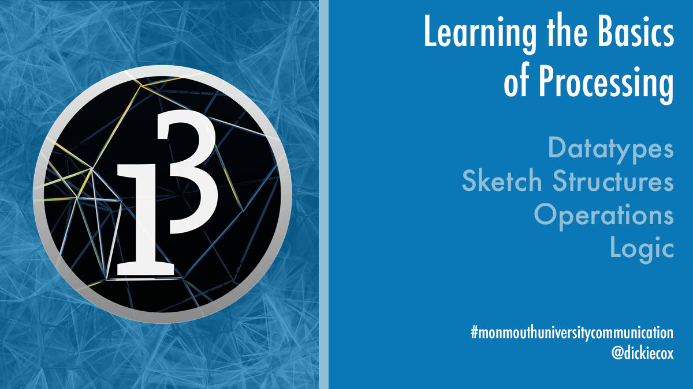

# Introduction to Processing for Communciation and Interactive Media Students
This is the initial repository for my course CO-404 Responsive Media which covers Datatypes, Processing Structures, Operations, and Logic. The course blog is available at [CO404 Wordpress](https://co404.wordpress.com/).

Datatypes, Processing Structures, Operations, and Logic

## Installing
1. Make sure you have these installed
	- [processing](https://processing.org/)
2. Clone this repository into your local machine's Processing projects directory using the terminal (mac) or Gitbash (PC) `> git clone CLONEURL`
3. CD to the folder `cd FOLDERNAME`

## More Stuff
Check out some of my my other repositories on [GitHub](https://github.com/dickiecox) and my interactive projects at [dickiecox.com](http://dickiecox.com/). You can follow me on [Instagram](https://www.instagram.com/dickiecox/) or check out my [my blog](http://dickiecox.com/blog/).

## Great Helping Links
[Getting Started with Processing](https://processing.org/tutorials/gettingstarted/)
[Processing Overview](https://processing.org/tutorials/overview/)
[Processing Drawing](https://processing.org/tutorials/drawing/)
[Processing Color](https://processing.org/tutorials/color/)
[Processing Objects](https://processing.org/tutorials/objects/)
[Processing Interactivity](https://processing.org/tutorials/interactivity/)
[Processing Typography](https://processing.org/tutorials/typography/)
